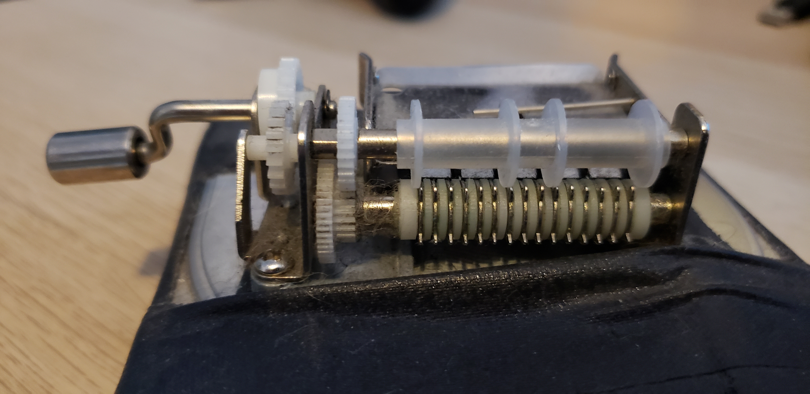

# Hard Drive Music Box

Back in college I picked up a paper tape fed music box for a student film score that needed a lullaby. Years later I haven't used it much as it's time consuming to punch the paper and is, frankly, not very environmentally friendly way to go about it.

## Specs

* 16-bit/44.1khz mono wavs
* Recorded in an AB Spaced Pair using LOM USI Pro's
* Monolith NKI format with RAW samples supplied
* Music Box built in G# Major in two octaves. Kontakt interpolated into Chromatic and 3-oct
* Music Box lovingly gaff tapped to an empty hard drive case
