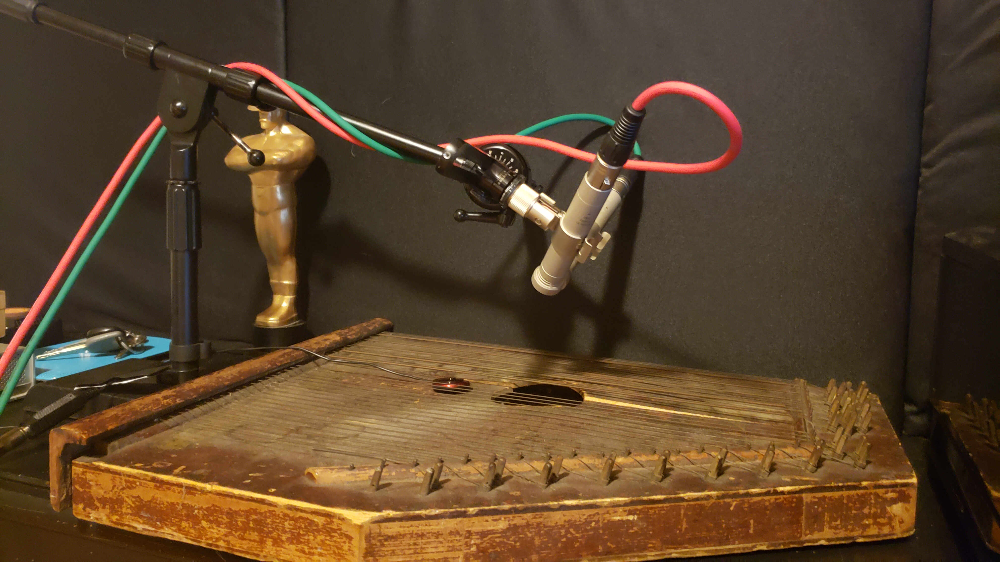

# Antique Zither

Hey there!

Thank you for taking the time to try out my little Kontakt library.
This is an instrument I found at thrift store in New York City way back in 2011. Never had the chance to fix it up and get it in tip top shape but I thought it had some cool character and almost horror like vibes at times. Felt it worth recording.
It is currently in the Beta testing stage and there may be a few bugs here and there as I'm still working on the scripts under the hood.
Fun fact, I forgot the password for the script in the nki. Thankfully the script is saved separately as a text file but I'll need to remake the NKI from scratch.
Currently, raw WAV samples are not included but I can upload them should there be interest (it is about 210mb worth of files).

If you run into something egregious or workflow breaking, please don't hesitate to email me at jeff@jeffbricemusic.com or tweet me @jeffbrice

I hope you enjoy using Antique Zither!

<3 Jeff (Pumodi)

## Changelist

v0.1
* Initial Upload of Beta version
* Known Issue: Reverb knob does not currently function. Reverb is implemented but the GUI is not working correctly.
* Thank you for beta testing Antique Zither! <3 Jeff
